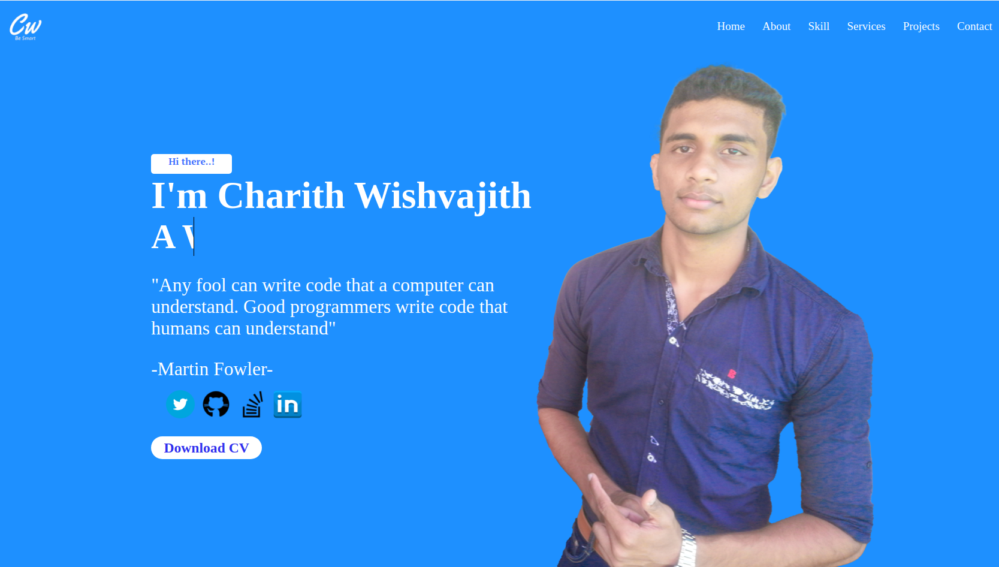

##Personal Profile
##This is the project of the personal website  

--- This is my personal website it has mainly six sections they are;
<ul>
    <li>Home</li>    
    <li>About</li>    
    <li>Skill</li>    
    <li>Service</li>    
    <li>Projects</li>    
    <li>Contact</li>    
</ul>

##Home page

Its shows some informations about my career. 
There are :-
 <li> My professinal accounts details  
 <li> Short Description about me like educational level  
 <li> Services that I providing  
 <li> Projects that I have created   
 <li> Assignment that I have done   
 <li> My contact details
    
  
Refer the structural details of the page :
 <li> <a href="https://www.gloomaps.com/">Visual site map</a></li>
 <li> <a href="https://wireframe.cc/HnABtB">Wire Frame</a></li>
 <li> <a href="https://www.figma.com/file/QhciT7BfnBXxFWONNQTgiL/Web_Project?node-id=0%3A1">Mokup of the site</a></li>
 <li> <a href="https://charithwishvajith.000webhostapp.com/">Web Host</a></li>
 <li> <a href=" https://charith127.github.io/MyProfile/">GitHub Pages</a></li>